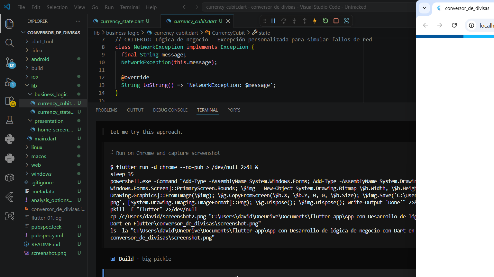

# 💱 Conversor de Divisas en Tiempo Real

Aplicación móvil Flutter que convierte entre 11 divisas usando tasas de cambio actualizadas en tiempo real vía API. Desarrollada como proyecto universitario con énfasis en **separación de la lógica de negocio**, **diseño de UI** y **manejo robusto de excepciones**.

## 📱 Screenshots



## ✨ Funcionalidades

- **Conversión en tiempo real** con tasas actualizadas diariamente vía [currency-api](https://github.com/fawazahmed0/currency-api)
- **11 divisas soportadas:** USD, EUR, GBP, JPY, CAD, MXN, BRL, ARS, CHF, CNY, DOP
- **Botón swap** para invertir divisa de origen y destino al instante
- **Validación de entrada** (vacío, no numérico, negativo)
- **UI reactiva** con feedback visual por estado (carga, éxito, error)

## 🏗️ Arquitectura

El proyecto sigue una **arquitectura limpia** separando claramente la lógica de negocio de la UI:

```
lib/
├── main.dart                          # Punto de entrada y tema global
├── business_logic/
│   ├── currency_state.dart            # Jerarquía de estados (abstracta)
│   └── currency_cubit.dart            # Lógica de negocio + API calls
└── presentation/
    └── home_screen.dart               # UI con Material Design 3
```

### Separación de responsabilidades

| Capa | Archivo | Responsabilidad |
|------|---------|----------------|
| **Estado** | `currency_state.dart` | Define `CurrencyState` (abstracta) y sus derivados: `Initial`, `Loading`, `Success` (con `result`, `rate`, `from`, `to`), `Error` (con `message`) |
| **Lógica** | `currency_cubit.dart` | Validación de entrada, llamada asíncrona a la API, manejo de excepciones (`FormatException`, `NetworkException`), actualización de estado vía `ChangeNotifier` |
| **UI** | `home_screen.dart` | Widgets Material Design 3, reactivos al estado via `ListenableBuilder`, feedback visual diferenciado |

## 🔧 Stack técnico

- **Framework:** Flutter 3.x (Material Design 3)
- **Lenguaje:** Dart 3.x
- **API de tasas:** [currency-api](https://github.com/fawazahmed0/currency-api) vía jsDelivr CDN (`cdn.jsdelivr.net/npm/@fawazahmed0/currency-api`)
- **HTTP:** `package:http`
- **Estado:** `ChangeNotifier` + `ListenableBuilder`

## 🚀 Instalación y ejecución

```bash
# 1. Clonar el repositorio
git clone https://github.com/tu-usuario/conversor-de-divisas.git
cd conversor-de-divisas

# 2. Instalar dependencias
flutter pub get

# 3. Ejecutar (seleccionar dispositivo cuando aparezca)
flutter run
```

### Ejecutar en plataforma específica

```bash
# Web
flutter run -d chrome

# Windows
flutter run -d windows

# Android (emulador o dispositivo físico)
flutter run -d android
```

## 🧪 Criterios de evaluación cubiertos

### ✅ Lógica de negocio
- Clase abstracta `CurrencyState` con 4 estados concretos
- Procesamiento asíncrono con `Future` (llamada real a API externa)
- Lógica pura en Dart separada de la UI (`ChangeNotifier`)

### ✅ Manejo de errores
- `try-catch` con `FormatException` para entradas vacías, no numéricas o negativas
- Excepción personalizada `NetworkException` para errores de API (HTTP status codes)
- Captura genérica de errores inesperados
- Cada error muestra mensaje específico en la UI

### ✅ UI y experiencia de usuario
- Material Design 3 con `colorSchemeSeed`
- `TextField` con teclado numérico
- `DropdownButtonFormField` para selección de divisas
- Botón swap para invertir divisas
- `FilledButton` para ejecutar conversión
- `CircularProgressIndicator` durante carga
- Contenedor verde con resultado + tasa de cambio (éxito)
- Contenedor rojo con icono de advertencia + mensaje (error)
- `dispose()` de `TextEditingController` y `CurrencyCubit`

## 📄 Licencia

Proyecto académico — uso educativo.
